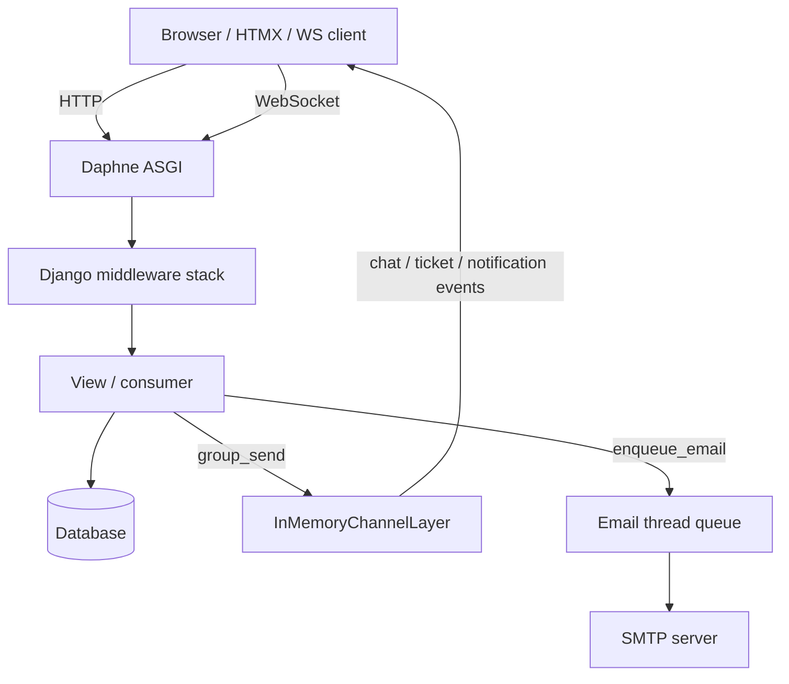

# Architecture

How the mlamehticket Django monolith is structured, how a request flows through it, and which background/realtime pieces it deliberately does not use.

**Audience:** Developers contributing to or operating the application codebase.

## Overview

mlamehticket is a **Django 6 monolith** that serves server-rendered HTML (SSR) with HTMX partials and a small amount of vanilla JavaScript/CSS. There is no SPA frontend framework and no Tailwind.

Real-time updates use **Django Channels** behind **Daphne**. Email is sent from an **in-process thread queue**. The channel layer is **in-memory**. There is **no Celery** and **no Redis**.

## Django apps

| Package | Role |
|---|---|
| `config` | Settings, root URLconf, WSGI/ASGI entrypoints |
| `accounts` | Custom user model, auth views, user management, force-password-change middleware |
| `core` | Organization entities (branch, department, ticket category, role), email settings/templates, maintenance tools, seeds |
| `tickets` | Ticket lifecycle, chat, list/dashboard, merge/transfer, WebSocket consumers |
| `notifications` | In-app notifications, WebSocket consumer, email queue/jobs, webpush patches |
| `news` | Announcements |
| `kb` | Knowledge base articles and KB categories (separate from ticket categories) |

Packaging-only code lives under `installer/`. Translation tooling is `scripts/i18n.py` (not an installed app).

## Stack at a glance

| Concern | Choice |
|---|---|
| Framework | Django 6, templates + HTMX |
| CSS / JS | Vanilla CSS (`static/css/`), vanilla JS (`static/js/`); Tom Select via CDN; Chart.js on the dashboard |
| ASGI server | Daphne (`daphne` first in `INSTALLED_APPS`) |
| WebSockets | Channels + `AuthMiddlewareStack` |
| Channel layer | `channels.layers.InMemoryChannelLayer` (process-local; not shared across workers) |
| Task / email queue | In-process daemon thread (`notifications.email_queue`) — **not Celery** |
| Static files | WhiteNoise |
| Database | SQLite by default; MySQL via PyMySQL when `DB_ENGINE=mysql` |
| Web push | `django-webpush` (with runtime patches in `notifications.apps`) |
| Auth model | `AUTH_USER_MODEL = accounts.User` |

### Explicit non-goals

- **No Celery / Redis / RQ** for background work — email jobs run in a daemon thread inside the web process.
- **No Redis channel layer** — `InMemoryChannelLayer` means WebSocket broadcasts stay inside a single Daphne process. Do not scale to multiple workers without changing this.
- **No Tailwind** — styling is hand-written CSS.

## Middleware order

Configured in `config/settings.py` as:

1. `SecurityMiddleware`
2. `WhiteNoiseMiddleware`
3. `SessionMiddleware`
4. `LocaleMiddleware`
5. `CommonMiddleware`
6. `CsrfViewMiddleware`
7. `AuthenticationMiddleware`
8. `MessageMiddleware`
9. `XFrameOptionsMiddleware`
10. `core.middleware.NoCacheAfterLogoutMiddleware`
11. `accounts.middleware.ForcePasswordChangeMiddleware`

Notable custom behavior:

- **NoCacheAfterLogoutMiddleware** — for authenticated responses, adds never-cache headers so the browser back button cannot show stale authenticated pages after logout.
- **ForcePasswordChangeMiddleware** — if `user.requires_password_change` is true, redirects every request (except password change, logout, static/media/admin) to `password_change`.

## Authentication

- Backend: `accounts.backends.CaseInsensitiveModelBackend` (username lookup is case-insensitive).
- `LOGIN_URL = "login"`; successful login redirects to `tickets_list`.
- Usernames are normalized to lowercase on save.

## Request flow

HTTP requests hit Daphne → Django ASGI → middleware → URL include → view. Ticket/message saves may fan out to Channels groups and enqueue email jobs. WebSocket connections share the same Daphne process and session auth.

## Realtime surfaces

| Path | Consumer | Typical group |
|---|---|---|
| `ws/tickets/` | `TicketListConsumer` | `ticket_list`, `ticket_list_branch_{id}`, `ticket_list_department_{id}` |
| `ws/tickets/<ticket_id>/` | `TicketChatConsumer` | `ticket_{id}` |
| `ws/notifications/` | `NotificationConsumer` | `user_{id}_notifications` |

Unauthenticated WebSocket connects are closed with code **4401**. See [realtime.md](realtime.md).

## Email delivery

Notification services call `enqueue_email(...)`, which starts a daemon worker thread on first use and processes jobs from an in-process `queue.Queue`. Message-reply emails are often delayed (120 seconds) to reduce noise. Email toggles on `EmailSetting` gate **email only**; in-app and web push still fire.

Details: [notifications-internals.md](notifications-internals.md).

## Related docs

- [Project structure](project-structure.md)
- [Data model](data-model.md)
- [URL reference](url-reference.md)
- [Permissions and scoping](permissions-and-scoping.md)
- [Contributing](contributing.md)
