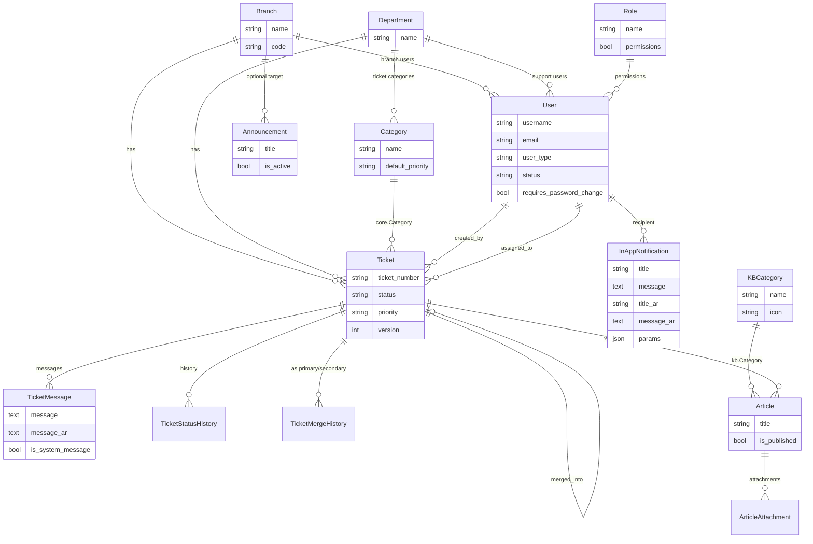

# Data model

Domain models across apps, relationships, and the important distinction between ticket categories and knowledge-base categories.

**Audience:** Developers implementing features or migrations that touch persistence.

## Conventions

- Primary keys are Django `BigAutoField` defaults unless noted.
- `core.TimeStampedModel` is an abstract base with `created_at` / `updated_at`.
- Ticket status and priority use `TextChoices` on the model.
- Ticket numbers are generated on first save: `{BRANCH_CODE}-{YYYYMMDD}-{SEQ}` with `select_for_update` sequencing.

## Entity relationship overview

## `accounts.User`

Extends `AbstractUser`.

| Field | Notes |
|---|---|
| `email` | Unique, nullable/blank |
| `phone` | Optional |
| `role` | FK → `core.Role` (`SET_NULL`) |
| `branch` | FK → `core.Branch` (expected for `user_type=branch`) |
| `department` | FK → `core.Department` (expected for `user_type=support`) |
| `user_type` | `branch` (Needs Support) or `support` (Support Agent) |
| `status` | `active` / `inactive` |
| `requires_password_change` | Triggers force-change middleware |

Usernames are strip-lowercased on save. Indexes exist on `user_type`, `status`, `department`, and `branch`.

## `core` models

### `TimeStampedModel` (abstract)

`created_at`, `updated_at`.

### `Branch`

`name`, unique `code`. Used for ticket ownership and branch-user scoping.

### `Department`

Unique `name`. Owns ticket categories and scopes support agents.

### `Category` (ticket categories)

Belongs to a `Department`. Unique `(department, name)`. Has `default_priority` (`low` / `medium` / `high` / `urgent`).

**This is not the knowledge-base category.** Tickets always FK to `core.Category`.

### `Role`

Named role with ~31 boolean permission flags covering tickets, dashboard, settings CRUD (users/branches/departments/categories/roles), email, news, KB, and maintenance. Saving a role named `admin` (case-insensitive) forces all boolean fields to `True`.

### `EmailSetting`

SMTP connection fields, from identity, `is_active`, and per-event email toggles (`notify_new_ticket`, `notify_ticket_picked`, `notify_ticket_message`, `notify_ticket_status`, `notify_ticket_update`, `notify_announcement`). At most one active row (unique constraint on `is_active=True`).

### `EmailTemplate`

One row per `event_type` (new ticket, picked, message, status, update, transfer variants, announcement) with `subject` and `body` (plain text + merge tokens).

## `tickets` models

### `Ticket`

| Area | Fields / behavior |
|---|---|
| Identity | Unique `ticket_number`, `title`, `description` |
| Org | `branch`, `department`, `category` (`core.Category`) — category must match department |
| State | `status`: `open`, `in_progress`, `waiting_for_branch`, `closed`, `merged` |
| Priority | `low`, `medium`, `high`, `urgent` |
| People | `created_by`, `assigned_to`, transfer FKs `pending_transfer_to` / `pending_transfer_by` |
| Merge | `merged_into` self-FK; cannot un-merge once `merged` |
| Concurrency | `version` |
| Client | `client_name`, `client_phone` |
| Time tracking | `picked_at`, `closed_at`, `last_status_change_at`, `total_pending_duration_seconds` |

Status transitions update time-tracking fields in `save()` (for example, accumulating waiting duration when leaving `waiting_for_branch`).

### `TicketStatusHistory`

Audit trail: `ticket`, `status`, `event_type` (status change, transfer lifecycle, merged, priority, assigned, reopened), optional `detail`, `changed_by`, `created_at`.

### `TicketMessage`

Chat / system lines: `sender`, `message`, optional `message_ar` (used for system bilingual copy), `attachment`, `reply_to`, `is_system_message`. Rejects non-system messages on closed/merged tickets; requires message or attachment.

### `TicketMergeHistory`

Records `primary_ticket`, `secondary_ticket`, `merged_by`, `merged_at`.

## `notifications.InAppNotification`

Per-recipient row:

- English `title` / `message` (source of truth for dedupe, web push, fallback)
- Arabic `title_ar` / `message_ar`
- Optional `title_key` / `message_key` and `params` JSON
- `link`, `notification_type`, `is_read`, `created_at`

Types include `new_ticket`, `ticket_picked`, `status_change`, `message`, `transfer`, `announcement`, `general`.

## `news.Announcement`

`title`, `content`, `is_active`, optional `expires_at`, optional `target_branch` (blank = all branches), `created_by`. `is_expired` is a property comparing `expires_at` to now.

## `kb` models

### Important: two different `Category` models

| Model | App | Used for |
|---|---|---|
| `core.Category` | `core` | Ticket categorization under a department |
| `kb.Category` | `kb` | Knowledge-base article grouping (name, description, icon) |

Never import one when you mean the other. Ticket FKs always point at `core.Category`. Articles point at `kb.Category`.

### `Article`

`title`, HTML `content`, `is_published`, optional `related_ticket` → `tickets.Ticket`, `created_by`. Extends `TimeStampedModel`.

### `ArticleAttachment`

File upload under `kb/{article_id}/…`, FK to `Article`.

## Related docs

- [Architecture](architecture.md)
- [Permissions and scoping](permissions-and-scoping.md)
- [Notifications internals](notifications-internals.md)
